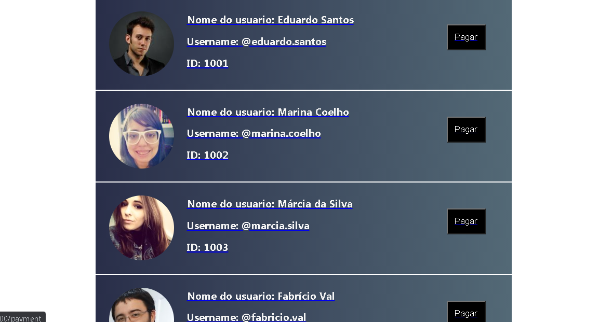

baseado no challenge da picay, o objetivo é criar uma interface com usuarios e ao clicar nela ir para url de pagamento 
com e ao colocar o valor diferente de 0 e o cartão correto, que é "4111111111111234" exibi o modal de sucesso, caso contrario não

